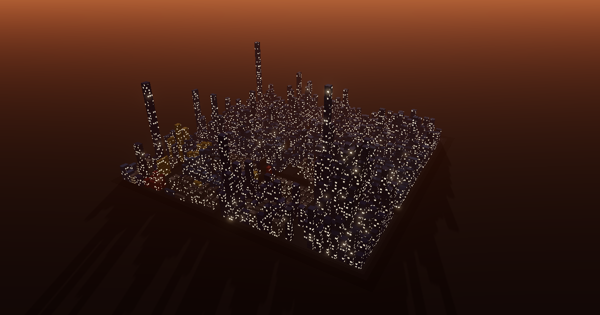

# chronocity

Watch a git repo grow into a city.

**[Live demo →](https://dat999zx.github.io/chronocity/)**



Every file is a building, every folder a district, and height is lines of code. Press play and the whole history replays:
buildings rise when files are added and collapse when they're deleted, and windows light up on the files each commit touches.
Then export a 15-second MP4 of it, landscape or vertical.

Every effect means something:

- **Sky** — the hours the authors actually committed, in their own time zone. A night-owl repo stays dark; a 9-to-5 repo stays sunny.
- **Fog** — quiet stretches longer than 3 days, squeezed out of the timeline.
- **Rain** — bursts of code churn (data files don't count).
- **Color** — language, in GitHub's linguist palette. Data files are low grey warehouses, not towers.

Click any building or district for its story: size, history, its last changes with `+added −removed`, and the real diff from GitHub.
Links like `?select=src/cli/program.ts` open straight to it.
Keys: <kbd>Space</kbd> play/pause, <kbd>←</kbd>/<kbd>→</kbd> step one commit, <kbd>Esc</kbd> close.

## Render your own repo

Clone it with git, then drop the folder anywhere on the page (or use *choose a folder…* in the intro card, ⓘ top-right).
Only its `.git` history is read and replayed, right in your browser in a background thread. Nothing is uploaded, there
is no server, and ignored files (node_modules, build output) are never touched. In browsers without Chrome's
folder-picker API (Brave, Firefox, Safari) you drag the folder in: their only other picker lists every file in the folder
behind an "Upload N files?" prompt.

A plain GitHub URL can't work without one: browsers aren't allowed to clone from GitHub, and "Download ZIP" archives
contain no history. So pasting a URL in the card gives you the `git clone` command to run first.
Limits: a `.git` up to 400 MB, and a full clone (not `--depth 1`).

## Run it

Needs Node 24+ (tests and the bake script run the TypeScript directly).

```sh
npm install
npm run dev     # http://localhost:5173
npm test        # core unit tests
```

Bake another repo into a demo (from a clone, first-parent history, up to 2,000 steps):

```sh
node packages/bake/bake.ts <path-to-clone> <name> <owner/repo> [ref]
```

## How it works

- `packages/core`: pure TypeScript.
  - A first-parent history walker, with isomorphic-git injected and line-multiset `+/−` counts.
  - A squarified-treemap layout over every path that ever existed, so nothing moves as time passes.
  - Sky, fog and rain as pure functions of playback time.
- `packages/web`:
  - Three.js: instanced buildings, procedural windows, shadows, bloom.
  - The inspect card, with diffs fetched from GitHub's compare API.
  - Frame-stepped MP4 export through WebCodecs and [Mediabunny](https://github.com/Vanilagy/mediabunny).
- `packages/bake`: walks a repo in Node and writes the demo JSON.

## Prior art

[Gource](https://gource.io) (2009) has owned "watch my project get built" for years, and CodeCity (Wettel, 2008) started code cities.
JSCity, BabiaXR-CodeCity, code-city and [Gizual](https://gizual.com) are the neighbours.
chronocity is the browser-only, zero-install, timelapse-first take.

## License

[MIT](LICENSE)
